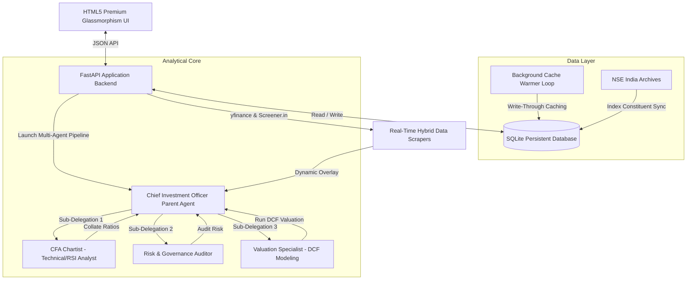

# 📊 High-Fidelity Indian Stock Analyzer & Screener
A multi-agent, profile-aware investment analyzer and quantitative stock screener designed for the Indian equity market (NSE). Powered by a hierarchical LLM coordinator (Groq/Llama-3), a persistent SQLite caching database, and a highly responsive, premium interactive glassmorphism UI.

---

## 🏗️ System Architecture

The application operates as a hierarchical, multi-agent financial research analyst network. Below is the system flow showing how requests are processed:



---

## 💎 Core Feature Matrix

| Feature Section | 🔍 Data Source | 🧮 Mathematical Calculation | ⚡ Investor Impact | 🔄 Refresh Frequency |
| :--- | :--- | :--- | :--- | :--- |
| **Multi-Agent Research Suite** | `yfinance` & `Screener.in` | Blends structural fundamentals, technical momentum, and intrinsic value indicators into a dynamic **AI Advisory Score (0-100)**. | Delivers a hyper-personalized investment prospectus custom-tailored to the user's active investor profile. | **Real-time on-demand** (Write-through caching updates database instantly). |
| **Historical P/E Bands (3-5Y)** | `yfinance` 5-year monthly prices & TTM Consolidated EPS | Sorts 60 months of historical P/E multiples ($Price_t / EPS_t$) to extract the absolute Min, Max, and chronological Median. | Prevents Standalone vs. Consolidated mismatches; isolates true premium or discount relative to historical norms. | **24-hour cache lifespan** (Incremental background refreshes). |
| **Self-Healing Valuation Engine** | `yfinance` Trailing EPS & Scraped Screener Cards | Cross-validates scraped P/E against real-time derived P/E: $\text{Price} / \text{TTM\_EPS}$. Triggers overrides on anomalies (discrepancy $> 50$ or P/E $> 300$). | Bypasses corrupted external datasets automatically (e.g. self-heals `GVT&D.NS` / GE Vernova T&D P/E from outdated `706` to true `106.4`). | **Automatic on-load** (Self-heals cached profiles during cache-misses). |
| **AI Stock Screener** | Persistent SQLite `screener_universe` and `cached_profiles` | Filters active index constituents against **dynamic quality gates** (Debt/Equity, ROE%, promoter pledge, EPS growth). | Customizes universe scans instantly; Conservative profile tightens gates while Aggressive profile rewards high growth. | **Sub-millisecond execution** (Leverages persistent SQLite cache). |
| **Fully Real-Time Alert Engine** | SQLite active triggers & real-time scanner | Constant silent background sweeps auditing conditions ($Price > SMA_{200}$ or $RSI_{14} \le 30$) in the background. | Emits Web Audio API synthesized double-beeps (`880Hz` -> `1200Hz`) and increments header bell badge counts in real-time. | **Continuous background loop** (Active polling every 30 seconds). |
| **Index Explorer** | NSE India official CSV constituent listings | Direct fetch & download of official Nifty 100, Midcap 150, and Smallcap 250 baskets. | Provides complete visibility over index caching status (`WARMED 🟢` or `COLD ⚪`) with 1-click deep research. | **Manual Sync** or **On-Start Auto-Rebalance** (10-second initial boot delay). |
| **Bloomberg-Style Sub-Tabs** | Dynamic client DOM controller | Groups 21 dashboard cards into 6 sub-tabs, firing window resize events on toggles to trigger synchronous Chart.js redraws. | Maximizes visual hierarchy, saving vertical scroll space; keeps charts responsive and scaled correctly to their containers. | **Instantaneous** (Client-side interactive toggles). |

---

## 🛠️ Feature Deep Dive & Calculations

### 1. Unified Multi-Agent Research Engine
When a stock is searched in the **Single Stock Workspace**, the `Chief Investment Officer (CIO) Agent` coordinates a parallel analytical pipeline:
*   **CFA Chartist (Technicals)**: Evaluates the Relative Strength Index ($RSI_{14}$) and the 200-day Simple Moving Average ($SMA_{200}$).
*   **Risk Auditor (Governance)**: Scrutinizes leverage limits (Debt-to-Equity), working capital safety (Current Ratio), cash flow durability ($\text{CFO-to-PAT} \ge 0.8$), promoter pledge percentages, and auditor qualifications.
*   **Valuation Specialist (DCF Model)**: Calculates intrinsic value using a two-stage **Discounted Cash Flow** formula:
    $$PV = \sum_{t=1}^{5} \frac{FCF_0 \cdot (1 + g)^t}{(1 + WACC)^t} + \frac{FCF_5 \cdot (1 + g_n)}{(WACC - g_n) \cdot (1 + WACC)^5}$$
    *Where $g$ is the 5-year revenue growth projection, $WACC$ is the weighted average cost of capital, and $g_n$ is the terminal growth rate (capped at 4.5% to represent long-term GDP constraints).*

### 2. Look-Ahead Bias-Free P/E Bands
Traditional historical P/E calculations often suffer from *Look-Ahead Bias* (dividing historical stock prices by today's high EPS) or fail completely due to `NaN` annual report entries. 

Our engine resolves this by:
1.  **Chronological EPS Mapping**: Dropping `NaN` filings and chronological sorting of valid historical EPS points.
2.  **Bridging the Gap**: Appending `yfinance` `trailingEps` to represent the most recent rolling 12-month period.
3.  **CAGR Discounting Fallback**: If no historical EPS is found, the engine reconstructs the previous 5 years by discounting today's trailing EPS backward using a realistic 12% annual equity growth rate ($\text{historical\_eps} = \text{trailing\_eps} \times 0.88^i$).
4.  **Consolidated Value Lock**: The main stock P/E is overridden with the latest P/E in the consolidated history list, preventing Standalone vs. Consolidated mismatches (e.g., for JSW Energy).

### 3. Dynamic Self-Healing Valuation Engine
To prevent external data corruption or lag (for instance, **Screener.in** listing an outdated Standalone P/E of **706** for `GVT&D.NS` / GE Vernova T&D India Ltd), the backend applies an automated self-healing validation gate:
$$\text{Derived P/E} = \frac{\text{Current Price}}{\text{TTM Trailing EPS}}$$
*   **Discrepancy Check**: If $|\text{Scraped P/E} - \text{yfinance Trailing P/E}| > 50$, the system automatically overrides the P/E with the verified yfinance trailing multiple.
*   **Outlier Cap**: If $\text{Scraped P/E} > 300$ and $\text{Derived P/E} < 150$, the scraped outlier is flagged as corrupted and healed instantly to the derived P/E.

### 4. Fully Real-Time Alert Engine & Audio Cues
Alert rule auditing operates as a real-time background loop:
*   **Silent Background Polling**: A client-side worker polls `/api/alerts/check` every 30 seconds.
*   **Audible Alerts**: Breached thresholds trigger a synthesized dual-tone double-beep (`880Hz` for 150ms -> `1200Hz` for 150ms) using the native browser **Web Audio API** (avoiding external audio asset files and respecting the user's settings menu toggle).
*   **Dynamic Notification Sync**: Breached alerts automatically increment the sticky header's notifications count badge, inject red-badged (`TRIGGERED`) alert summaries into the header dropdown panel, and refresh the active logs table in real-time.

### 5. Bloomberg-Style Sub-Tabs & Accordion Scaling
To maximize layout efficiency, the single-stock dashboard divides its 21 analysis cards into 6 sub-tabs:
*   **Layout Compression**: Below the sticky header, a premium glassmorphic accordion toggle (**`⚙️ CONFIGURE PDF REPORT SECTIONS ▼`**) collapses the 11-checkbox print filter panel smoothly using CSS transitions (`max-height 0.3s ease-out`), saving vertical workspace space by default.
*   **Chart.js Active-Scaling Hook**: Switching tabs strips `.card-hidden` from active elements and triggers a global `window.dispatchEvent(new Event('resize'))` alongside synchronous Chart.js `.resize()` and `.update()` calls. This forces all hidden price curves, Fibonacci ranges, and drawdown indicators to instantly scale and draw pixel-perfect layouts when brought into view.

---

## 🗄️ Database Schema (SQLite)

The application uses an optimized, persistent SQLite database located at `backend/data/watchlist_database.db`.

```sql
-- 1. Persistent Screener Universe
CREATE TABLE IF NOT EXISTS screener_universe (
    symbol TEXT PRIMARY KEY,
    base_symbol TEXT NOT NULL,
    company_name TEXT NOT NULL,
    sector TEXT NOT NULL,
    cap_type TEXT NOT NULL,         -- 'large', 'mid', or 'small'
    last_rebalanced TEXT NOT NULL
);

-- 2. Persistent Cached Financial Profiles
CREATE TABLE IF NOT EXISTS cached_profiles (
    symbol TEXT PRIMARY KEY,
    profile_json TEXT NOT NULL,     -- Complete analytical payload
    updated_at TIMESTAMP DEFAULT CURRENT_TIMESTAMP
);

-- 3. Persistent Alerts Schema
CREATE TABLE IF NOT EXISTS alerts (
    id TEXT PRIMARY KEY,
    ticker TEXT NOT NULL,
    condition_type TEXT NOT NULL,   -- 'PRICE', 'RSI', 'SMA'
    operator TEXT NOT NULL,         -- '>', '<', '<='
    value TEXT NOT NULL,
    status TEXT DEFAULT 'Active',   -- 'Active' or 'Triggered'
    triggered INTEGER DEFAULT 0,
    trigger_date TEXT DEFAULT ''
);

-- 4. Watchlist Tables
CREATE TABLE IF NOT EXISTS watchlists (
    id INTEGER PRIMARY KEY AUTOINCREMENT,
    name TEXT UNIQUE NOT NULL
);

CREATE TABLE IF NOT EXISTS watchlist_items (
    id INTEGER PRIMARY KEY AUTOINCREMENT,
    watchlist_id INTEGER,
    symbol TEXT NOT NULL,
    name TEXT,
    sector TEXT,
    FOREIGN KEY(watchlist_id) REFERENCES watchlists(id) ON DELETE CASCADE,
    UNIQUE(watchlist_id, symbol)
);
```

---

## ⚡ Background Tasks & Caching Policies

### 🔄 The Background Cache Warmer
Calculates and updates stock profiles incrementally without triggering third-party scraping rate limits or API blocks.
*   **Checking Frequency**: Runs once **every hour**.
*   **Initial Boot Delay**: **10 seconds** to allow core services to initialize cleanly.
*   **Refreshes**: Only targets entries older than **24 hours**.
*   **Throttling Delay**: Waits **4 seconds** between each stock update (and **10 seconds** on failure fallbacks) to respect rate limits.

---

## 🚀 Setup & Execution

### 1. Environment Configurations
Create a `.env` file in the root directory:
```env
GROQ_API_KEY=your_groq_api_key_here
PORT=8000
DATABASE_DIR=backend/data
```

### 2. Install Dependencies
```bash
pip install -r backend/requirements.txt
```

### 3. Run the Development Server
```bash
python -m uvicorn backend.main:app --port 8000 --reload
```

### 4. Run the Analytical Test Suite
Ensure database integrity and system calculations are durable by running the automated unit test suite:
```bash
python -m backend.test_models
```
*(All 10 comprehensive unit tests pass with `OK` status).*

---

## 🌐 API Endpoint Reference

The backend exposes a highly optimized, environment-gated REST API built on FastAPI.

| Method | Endpoint | Description | Request Payload / Params |
| :--- | :--- | :--- | :--- |
| **GET** | `/api/analyze` | Triggers real-time Multi-Agent consensus research. | `query` (symbol), `horizon` (optional), `risk` (optional) |
| **POST** | `/api/analyze-custom` | Recalculates DCF sandbox intrinsic value using custom overrides. | `query`, `horizon`, `risk_profile`, `revenue_growth`, `opm`, `wacc`, `terminal_growth` |
| **GET** | `/api/discover` | Runs AI Screener Engine across Strategy & Universe. | `strategy` (hybrid/bottom_up/top_down), `universe` (all/large/mid/small), `horizon`, `risk` |
| **GET** | `/api/universe` | Retrieves persistent NSE index constituent listings. | `cap_type` (optional: large/mid/small) |
| **GET** | `/api/admin/rebalance-status` | Returns rebalance sync timestamps & cache coverage. | None |
| **POST** | `/api/admin/rebalance` | Manually triggers fresh official NSE index downloads. | None |
| **POST** | `/api/alerts/set` | Registers a persistent condition-based indicator alert. | `ticker`, `condition_type` (PRICE/RSI/SMA), `operator`, `value` |
| **GET** | `/api/alerts/check` | Runs manual background sweeping check of active alerts. | None |
| **GET** | `/api/watchlists` | Lists all user watchlists and constituent items. | None |

---

## 🖥️ Interactive Workspace Tour

The premium glassmorphic user interface is divided into dedicated workspaces:

### 1. Unified Control Dashboard
*   **Index Universe Monitor**: Displays the current database synchronization status, indicating the exact size of your large, mid, and small-cap constituent databases and the current warm cache coverage.
*   **Manual Index Sync Trigger**: Initiates a background download of official NSE list updates with an animated progress container.
*   **Alert Tracker Panel**: View active alerts, trigger timestamps, and indicators.

### 2. Single Stock Workspace
*   **Core Metrics Table**: Comparative grid mapping analyst actions, ROE/ROCE percentages, debt levels, DCF safety margins, RSI, and moving average trends.
*   **Historical P/E Bands Card**: Plots current trailing P/E multiples directly against 5-year statistical medians, maximums, and minimums with color-coded premium indicators.
*   **Interactive DCF Sandbox**: Allows investors to custom-model growth rates, margins, and cost of capital, recalculating valuation models in real-time.
*   **Catalyst Headlines Feed**: Renders publisher, title, and links for news and technical articles.

### 3. AI Stock Screener
*   **Quantitative Strategy Selector**: Choose between Top-Down, Bottom-Up, or Hybrid screenings.
*   **Segment Selector**: Scan the entire universe or target specific segments (Large, Mid, or Small Caps).
*   **Global Investor Profile Configurator**: Adjusts quality gate criteria and blended scoring algorithms dynamically in the background based on Horizon and Risk boundaries.

---

## 💬 Developer Chat Slash Commands

When working with this codebase inside your agentic IDE, you can invoke the following shortcuts:

*   `/goal` — Use this when triggering long-running quantitative sweeps, automated database migrations, or system audits. The agent will execute sequentially, validating every phase, and will not stop until the goal is fully achieved.
*   `/schedule` — Use this to configure cron expressions or timers for background sweeps (e.g. running daily alerts verification sweeps at market close).
*   `/grill-me` — Use this to align on major database design changes or system upgrades through an interactive architecture interview.

---

## 🛠️ Diagnostics & Troubleshooting

> [!NOTE]
> All analytical database connections leverage connection context managers with foreign key constraints enabled by default.

### 1. Standalone vs. Consolidated Mismatch
If a stock's current P/E appears abnormally high (e.g., JSW Energy showing standalone P/E 115x) while its historical bands indicate a consolidated median (42x), the backend automatically overrides the displayed P/E using the latest calculated entry from the yfinance historical P/E list. This guarantees that current and historical metrics remain perfectly consistent on a consolidated basis.

### 2. Purging Stale Database Cache
To force-refresh an equity's profile or clear database write lock anomalies, execute this simple SQLite purge command from the root directory:
```bash
python -c "import sqlite3; conn = sqlite3.connect('backend/data/watchlist_database.db'); c = conn.cursor(); c.execute('DELETE FROM cached_profiles WHERE symbol = \'YOUR_TICKER.NS\''); conn.commit()"
```
Upon the next query or background warming loop, the system will rebuild and cache the profile using the latest real-time scraping structures.

